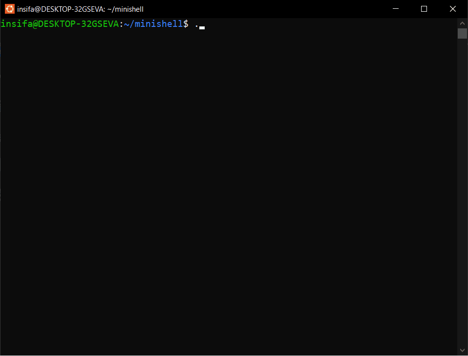

# 🐚 Minishell: Advanced Unix Shell Implementation

Bu proje, günlük hayatta kullanılan **Bash/Zsh** gibi shell yapılarının temel mantığını anlamak için sıfırdan **C dili** ile geliştirilmiş ileri seviye bir sistem programlama projesidir. Unix süreç modelini, sistem çağrılarını ve süreçler arası iletişimi (IPC) derinlemesine pratik eder.

## 📺 Demo
Projenin tüm yeteneklerini (Pipes, Redirection, Signals) aşağıda görebilirsiniz:



## 🚀 Özellikler

| Özellik | Açıklama |
| :--- | :--- |
| **REPL Döngüsü** | Kullanıcıdan komut alıp, işleyip, sonuç döndüren sonsuz döngü yapısı. |
| **Process Model** | `fork()`, `execvp()` ve `waitpid()` ile izole süreç yönetimi. |
| **Pipeline (|)** | `pipe()` ve `dup2()` kullanarak komut zincirleme (`ls \| grep .c \| wc -l`). |
| **Redirection (>)** | Komut çıktılarını dosyalara yönlendirme (`ls > liste.txt`). |
| **Backgrounding (&)** | Süreçleri arka planda (asenkron) çalıştırma desteği. |
| **History** | `readline` kütüphanesi ile yukarı/aşağı tuşlarıyla komut geçmişine erişim. |
| **Built-in Komutlar** | `cd`, `exit`, `export`, `env` gibi kabuğa gömülü fonksiyonlar. |
| **Signal Handling** | `Ctrl+C` sinyalini yakalayarak shell'in kararlılığını koruma. |
| **Dinamik Prompt** | Renkli, interaktif ve anlık çalışma dizinini (CWD) gösteren prompt. |

## 🏗️ Mimari Yapı


Proje, veriyi girdi olarak alıp işleyene kadar şu aşamalardan geçer:

1. **Lexer (Tokenizer):** Girdiyi anlamlı kelime parçalarına ve operatörlere (`|`, `>`, `&`) ayırır.
2. **Parser/Handler:** Komutun built-in mi, pipe mı yoksa yönlendirme mi içerdiğini belirler.
3. **Executor:** Çocuk süreçler oluşturur ve `dup2` ile dosya tanımlayıcılarını yönlendirerek işlemi icra eder.

## 🛠️ Kurulum ve Çalıştırma

Projenin derlenmesi için `gcc` ve `libreadline` kütüphanesi gereklidir.

1. **Bağımlılıkları Yükleyin (Ubuntu/Debian):**
```bash
sudo apt-get install libreadline-dev

```

2. **Projeyi Derleyin:**

```bash
make re

```

3. **Shell'i Başlatın:**

```bash
./minishell

```

## 📚 Kullanılan Sistem Çağrıları

* **Süreç Yönetimi:** `fork`, `execvp`, `waitpid`, `exit`
* **Girdi/Çıktı & IPC:** `pipe`, `dup2`, `open`, `close`
* **Dizin ve Ortam:** `chdir`, `getcwd`, `setenv`, `putenv`
* **Sinyaller:** `signal`, `sigaction`

## 🗺️ Gelecek Özellikler (Roadmap)

* [ ] **Input Redirection:** `<` operatörü ile dosyadan okuma desteği.
* [ ] **Append Redirection:** `>>` operatörü ile dosyanın sonuna ekleme yapma.
* [ ] **Logical Operators:** `&&` ve `||` ile koşullu komut çalıştırma.

---